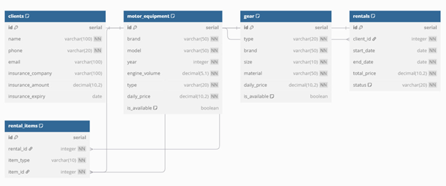

# Аналитическая система для проката мототехники

Проект представляет собой полноценную базу данных для гипотетической компании по прокату мототехники. Она создана для тренировки SQL-запросов и проведения аналитики. Помимо структуры БД, проект включает набор готовых потенциальных аналитических запросов и визуализацию ключевых метрик на Python.

## Доступные аналитические запросы

- Топ-5 самых арендуемых моделей
- Клиенты с просроченной страховкой
- Распределение длительности аренды
- Топ-10 клиентов по тратам
- Доступность шлемов по брендам и материалам

## Структура базы данных

ER-диаграмма:

<p align="center">
  
</p>

5 таблиц:
- **clients** — клиенты
- **motor_equipment** — мототехника
- **gear** — экипировка
- **rentals** — аренды
- **rental_items** — связь аренд с техникой/экипировкой

## Используемые технологии

- Python: pandas, matplotlib, seaborn, psycopg2
- PostgreSQL
- Git

## Как запустить

```bash
# 1. Установить зависимости
pip install -r requirements.txt

# 2. Выполнить SQL-скрипты в БД:
schema.sql # создать таблицы
data.sql # залить тестовые данные

# 3. Запустить код для визуализации
python main.py
```

## Структура проекта

```bash
├── main.py           # код
├── schema.sql        # создание таблиц
├── data.sql          # тестовые данные
├── queries.sql       # SQL-запросы
└── requirements.txt  # зависимости
└── images/
    └── erd.png       # ER-диаграмма
```

## Автор

Полина Спицына, ИТМО
